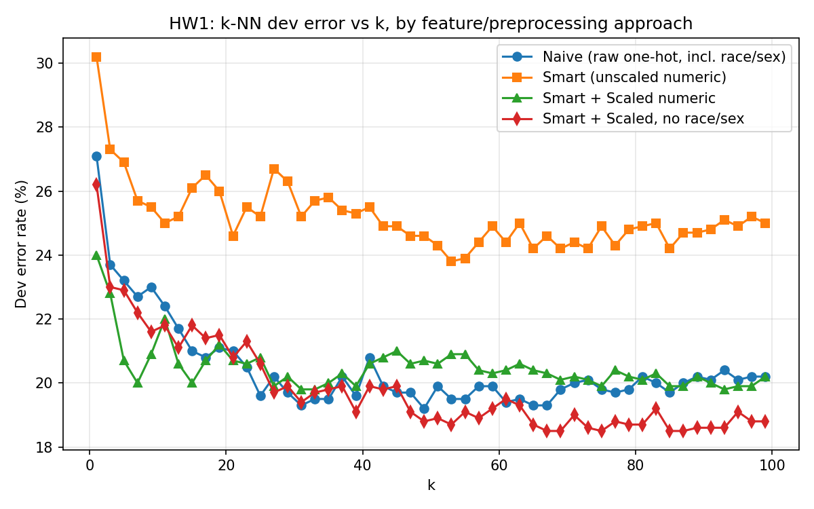

# HW1: k-NN for Income Prediction

**Course:** AI534 (Machine Learning), Oregon State University, Fall 2025
**Assignment:** [hw1_v3.pdf](https://web.engr.oregonstate.edu/~huanlian/teaching/ML/2025fall/unit1/hw1/hw1_v3.pdf) (20% of course grade, plus 3% extra credit)
**Task:** Predict whether an individual's income is `>50K` or `<=50K` from census attributes (age, sector, education, marital status, occupation, race, sex, hours worked, country) using k-nearest neighbors. Submitted and scored through a class Kaggle competition. Only k-NN is permitted for this assignment.

The assignment has six required parts and one extra-credit part:
1. Hands-on data exploration (positive rate, age/hours range, why categorical fields need one-hot encoding)
2. Naive binarization plus k-NN baseline (all fields one-hot encoded, including numeric ones)
3. Smart binarization (numeric fields kept as numbers, then scaled), rerun k-NN
4. Implement k-NN from scratch (no sklearn model), verify against sklearn's distances, analyze time complexity, compare Euclidean vs. Manhattan
5. Deployment: pick the best model, generate the final Kaggle submission
6. Written observations on k-NN's drawbacks and on bias amplification
7. Extra credit: plot naive vs. smart vs. smart+scaled dev error curves on one graph

## Results

Numbers below are as reported in [`hw1-report.pdf`](hw1-report.pdf), compared against the assignment's own benchmark hints (Part 2 Q4a, Part 3 Q1/Q2) so it's clear how this submission landed relative to what was expected.

| Approach | Features | Preprocessing | Best k | Dev error (reported) | Assignment's hinted range | Kaggle test score |
|---|---|---|---|---|---|---|
| Naive (`naive_knn.py`) | all 9 features | plain one-hot encoding, no scaling | 49 | 19.2% | ~16% best (1-NN ~23%) | 17.8% (17th place) |
| Smart (`smart_knn.py`) | all 9 features | one-hot + numeric passthrough (unscaled) | 49 | 24.0% | ~21% best (1-NN ~27%) | not submitted |
| Smart + Scaled (`smart_knn_scaled.py`) | all 9 features | one-hot + `MinMaxScaler(0,2)` on numeric | 33 | 19.7% | ~14-15% best (1-NN ~24%) | 17.6% (rank 52) |
| Own optimized k-NN (part 5) | tuned feature set | one-hot + `MinMaxScaler(0,2)`, Euclidean | 55 | **18.4%** | no fixed hint, graded on accuracy directly | **17.2% (rank 97, best entry)** |
| Custom k-NN, from scratch (`custom_knn.py`) | 7 features, drops race/sex | one-hot + `MinMaxScaler(0,2)`, Euclidean | 33 | 19.7% | not applicable | not submitted |

Each stage beat the previous one, following the progression the assignment expects (naive, then smart, then smart+scaled, then tuned), though the dev error at each stage ran a few points above the hinted target range. See "Ideas to close the gap" below if revisiting this.

`income.test.predicted.csv` in this repo is the actual file submitted for grading (18.7% positive rate, matching the report). It is not regenerated from the scripts here, since the exact "part 5" optimized script that produced the 18.4%/k=55 result wasn't part of this cleanup pass. The scripts in `src/` reproduce the naive, smart, and smart-scaled numbers above closely (within a point) when rerun. Small differences are expected due to sklearn version and neighbor tie-breaking, not a bug.



The chart above is generated by rerunning the code in this repo. A fourth line, `smart_scaled_no_demo`, is an unofficial variant explored beyond the write-up and included for reference (see `optim.py` / `smart_knn_scaled_no_demographics.py`).

k-NN is distance-based, so unscaled numeric features (`age` up to 90, `hours` up to 90) dominate the Euclidean distance and drown out the one-hot categorical features. That's why the unscaled "smart" approach actually performs worse than the naive baseline (24.0% vs. 19.2% dev error). Scaling numeric features into `[0, 2]`, matching the one-hot dimensions, fixed this and brought dev error back down to 19.7%. Further tuning in part 5 brought it to 18.4%. The from-scratch k-NN implementation (`custom_knn.py`) reproduces sklearn's results closely, which confirms the implementation is correct. The full analysis of algorithmic complexity, sorting tricks (`np.argpartition`), and Euclidean vs. Manhattan timing/accuracy tradeoffs is in the report (section 4).

**Bias note (from report, section 6.2):** in the 5,000-example training set, 30.7% of men and 12.9% of women earned `>50K`. On the 1,000-example dev set, the model's predictions were 3.8% of men and 28.6% of women labeled `>50K`, a sharp departure from the training distribution. The report attributes this to underfitting on a comparatively small, imbalanced training signal rather than a broader social-data issue. The assignment asks about this pattern in Part 6, as a general observation about bias amplification in ML rather than something specific to this dataset. Worth reading the full discussion in the report before treating any single k-NN error rate here as the complete picture.

### Ideas to close the gap with the hinted benchmarks

Since every stage landed a few points above the assignment's hint range, a few likely causes are worth checking if this is revisited:
- `naive_knn.py` and `smart_knn.py` build their own train/dev split from `income.train.5k.csv` instead of evaluating against the provided `income.dev.csv` directly (see "Known quirks" below). The assignment's hints are presumably calibrated against the official dev file.
- Double-check that no field is accidentally leaking the `target` label into the feature map (the assignment explicitly warns about this in Part 4.1). The recorded feature dimensionality (92 in the report) doesn't line up with the ~90 expected in Part 1 Q5, which is worth revisiting.
- Confirm `OneHotEncoder(handle_unknown='ignore')` is fit on train only, with dev and test using `.transform()` rather than a re-fit.

## Repo layout

```
hw1-knn-income/
├── data/                            # provided by course, not generated
│   ├── income.train.5k.csv          # 5,000 labeled training examples
│   ├── income.dev.csv               # 1,000 labeled dev examples
│   ├── income.test.blind.csv        # 1,000 unlabeled test examples
│   ├── toy.csv                      # small sanity-check set
│   └── sample_submission.csv        # course-provided example format
├── src/
│   ├── naive_knn.py                 # baseline: raw one-hot, no scaling
│   ├── smart_knn.py                 # feature selection, numeric passthrough (unscaled)
│   ├── smart_knn_scaled.py          # + MinMaxScaler on numeric features
│   ├── smart_knn_scaled_no_demographics.py  # best model: drops race/sex, scaled
│   ├── custom_knn.py                # k-NN implemented from scratch (no sklearn model)
│   ├── plot_results.py              # generates results/error_vs_k.png
│   └── random_output.py             # course-provided random baseline generator
├── results/
│   ├── k_values.csv                 # dev error per k, one column per approach
│   └── error_vs_k.png
├── income.test.predicted.csv        # final blind-test predictions (best model)
├── validate.py                      # course-provided submission format checker
└── requirements.txt
```

## How to reproduce

```bash
cd src
pip install -r ../requirements.txt

python3 naive_knn.py
python3 smart_knn.py
python3 smart_knn_scaled.py
python3 smart_knn_scaled_no_demographics.py   # writes the final income.test.predicted.csv
python3 custom_knn.py                          # from-scratch implementation, run independently
python3 plot_results.py                        # regenerates results/error_vs_k.png

cd ..
python3 validate.py income.test.predicted.csv  # sanity-check submission format
```

Each `smart_*` script appends its own column to `results/k_values.csv` so `plot_results.py` can compare all approaches on one chart. Run them in the order above, or delete `results/k_values.csv` and start fresh, if you want a clean comparison since each script only recomputes its own column.

## Notes and known quirks

- `naive_knn.py` and `smart_knn.py` build their own train/dev split from `income.train.5k.csv` via `train_test_split` rather than using the provided `income.dev.csv` directly. Results are broadly consistent between the two setups but not numerically identical to a run against the official dev file.
- The two scaled scripts originally wrote their dev-error column to a shared name (`smart_scaling`), so running both in sequence silently overwrote the first one's results in `k_values.csv`. Fixed here by giving each script (`smart_knn_scaled.py`, `smart_knn_scaled_no_demographics.py`) its own output column.
- The "part 5" optimized script that produced the final graded result (18.4% dev error, k=55, 0.172 Kaggle score) isn't among the files organized here. `income.test.predicted.csv` is kept as-is from the original submission rather than regenerated, so the deliverable matches what was actually graded.
- Section 4 of the report (per-point distance calculations for specific IDs, Euclidean vs. Manhattan timing comparison) references a script not included in this cleanup. See the report for that analysis and its numbers.

## Report

[`hw1-report.pdf`](hw1-report.pdf): full write-up covering data exploration, feature encoding rationale, the naive/smart/scaled progression, complexity analysis, the from-scratch k-NN implementation, and a debrief.
